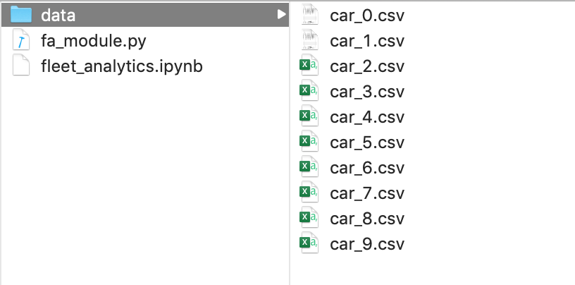
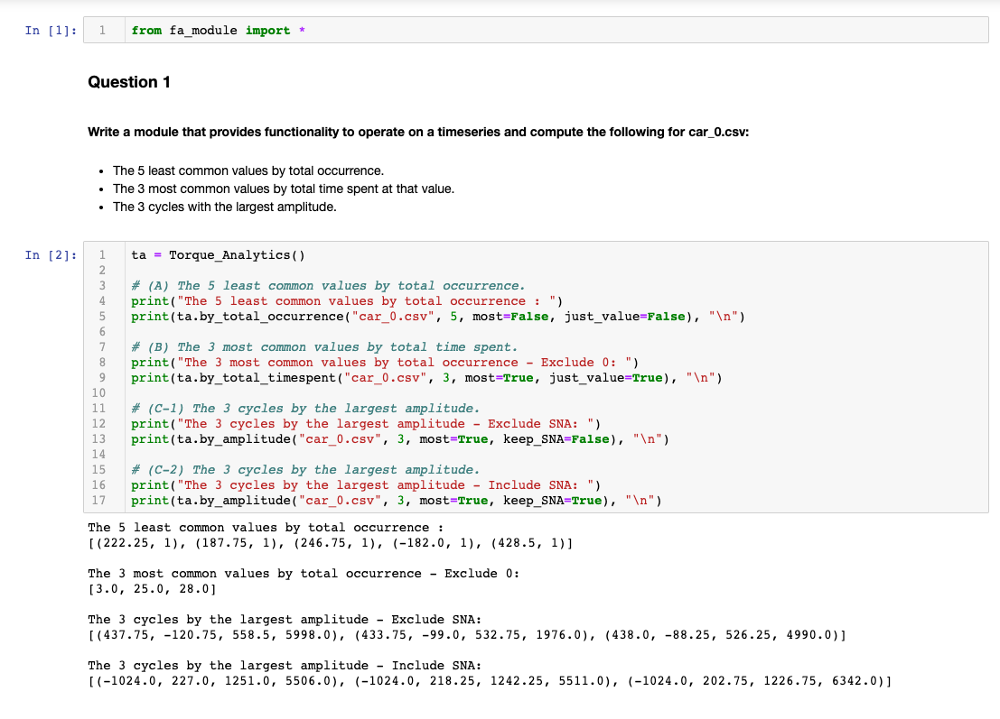
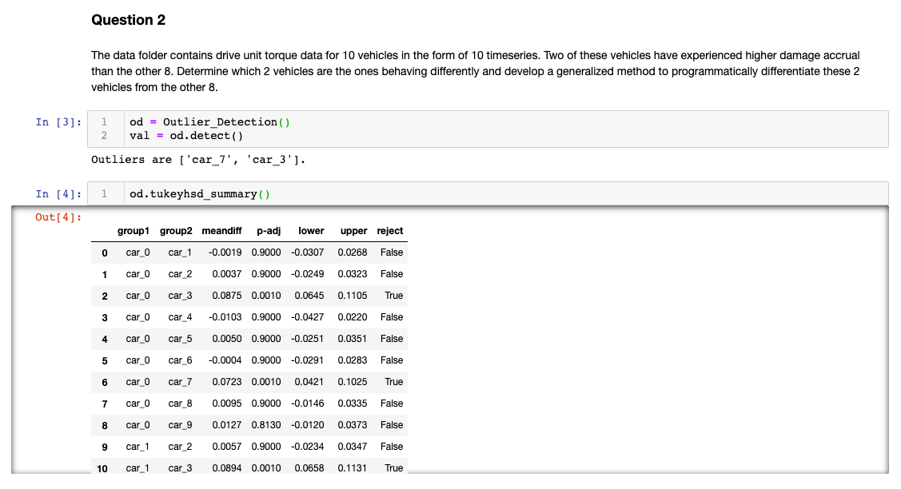

## Data Science Module (Time Series Analytics)

 
** Password Needed to Unlock Zipped File 

In this project, we created a data science module that analyze input timeseries data and extract the following metrics: 
- The top N most/least common values by occurrence
- The top N most/least common values by total time spent
- The top N largest/smallest cycles 
- Outliers within the data (generalized method)

** Define a cycle as a progression from a given local minima/maxima to the next immediate local minima/maxima.  
** Amplitude of a cycle is the difference between the minima and the maxima. 

 

### Dependencies

• os - check file/directory path

• datetime - date and time manipulations

• collections - defaultdict, counter

• pandas - dataset manipulation

• statsmodels - outlier detection, anova (ols, MultiComparison) - for Question 2

### Path

• current directory: fa_module.py (get the fa_module out of the data zipped file), data subdirectory

• data subdirectory - contains all car csv data.

• run any program in the current directory (eg., fleet_analytics.ipynb in the attached screenshot)

### Base Classes

• Torque_Analytics

• Outlier_Detection

  

### User Guide - Torque_Analytics (only documented the main ones)

- class Torque_Analytics.by_total_occurrence(file_name, N1, most=True, just_value=True,
    keep_zero=False)  
    >> Returns the top N most/least common values by total occurrence
    
    - Time Complexity:  
       _— Amortized Time Complexity: max(O(k log k), O(N))_  
       _where k is the number of unique signal values, N is the length of given time series._  
       _— Worst Time Complexity:O(N log N), if each signal values is unique._  
    - Parameters:
       - file_name: str
          — Specifies the name of the csv file.
       - N1: int
          — The number of values to be returned.
       - most: bool, default = True
          — When true, return top N most common values by total occurrence - vice versa.
       - just_values: bool, default = True
          — When true, only return the most/least common values. When false, return a list of
          tuple containing (values, total occurrence).
       - keep_zero: bool, default = False
          — When false, exclude 0 from our return values.
 
  
 
- class Torque_Analytics.by_total_timespent(file_name, N2, most=True, just_value=True,
    keep_zero=False)  
    >> Returns the top N most/least common values by total time spent
    
    - Time Complexity:  
       _— Amortized Time Complexity: max(O(N), O(k log k))_  
       _where k is the number of unique signal values, N is the length of given time series._  
       _— Worst Time Complexity:O(N log N), if each signal values is unique._  
    - Parameters:
       - file_name: str
          — Specifies the name of the csv file.
       - N2: int
          — The number of values to be returned.
       - most: bool, default=True
          — When true, return top N most common values by time spent - vice versa.
        - just_values: bool, default = True
          — When true, only return the most/least common values. When false, return a list of tuple containing (values, total time spent).
        - keep_zero: bool, default = False
          — When false, exclude 0 from our return values.

  

- class Torque_Analytics.by_amplitude(file_name, N3, most=True, keep_SNA=False)  
    >> Returns the top N largest/smallest cycles (by amplitude)

    - Time Complexity:  
       _— Amortized Time Complexity: max(O(m), O(k log k)))_  
       where k is the number of unique signal values   
       & m is the length of time series after dropping all the consecutive same signal value.  
       _— Worst Time Complexity:O(N log N), if each signal values is unique and local min/max._  
    - Parameters:
       - file_name: str
          — Specifies the name of the csv file.
       - N3: int
          — The number of values to be returned.
       - most: bool, default = True
          — When true, return top N largest cycles by amplitude - vice versa.
       - keep_SNA: bool, default = False
          — When false, exclude all of the SNA signals.

  

### User Guide - Outlier_Detection

- class Outlier_Detection.detect(keep_SNA=False) 
    >> Returns the outliers that have experienced higher damage accrual than the rest.
    
    - Parameters:
       - keep_SNA: bool, default=False
          — When false, exclude all of the SNA signals.
 

- class Outlier_Detection.tukeyhsd_summary()  

    >> Returns the summary from the MultiComparison Tukey’s Honest Significant Difference test.
    
    
    
 

## Examples

